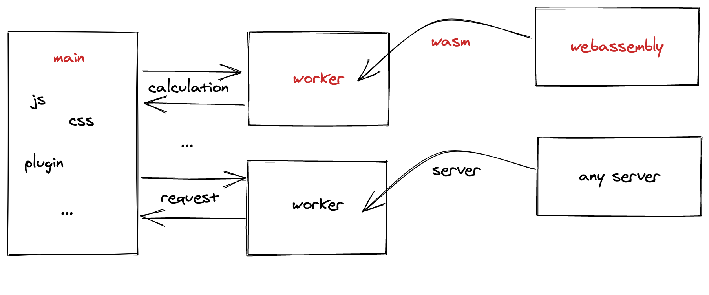
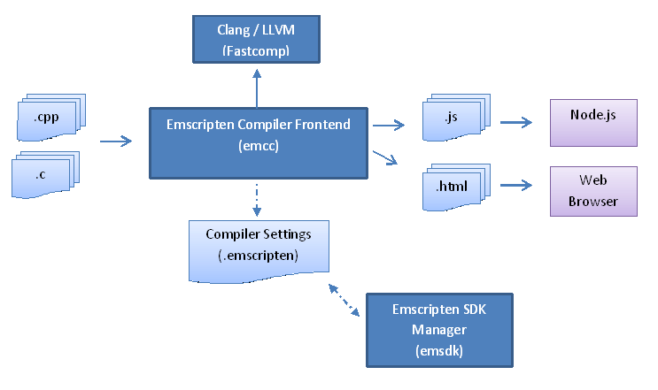

# rustin
web toy built by js &amp; rust

## 🚀[Webassembly](https://webassembly.github.io/spec/core/)
利用wasm字节码处理前端的耗时运算，让浏览器能够处理更多耗时任务。

### 测试设计
利用`web worker`让浏览器可以无阻塞运算，同时利用`wasm`文件处理高耗时运算。让浏览器体验更加平滑。

### 测试结果

## 😋[Rust语言](https://www.rust-lang.org/)

rust是一门年轻的语言，正式发行也不到十年时间。

### slogan

直接用官网介绍更专业一些，rust的特点：

A language empowering everyone to build reliable and efficient software.
一门赋予每个人构建可靠且高效软件能力的语言

- Performance 高性能
  Rust is blazingly fast and memory-efficient: with no runtime or garbage collector, it can power performance-critical services, run on embedded devices, and easily integrate with other languages.
  Rust 速度惊人且内存利用率极高。由于没有运行时和垃圾回收，它能够胜任对性能要求特别高的服务，可以在嵌入式设备上运行，还能轻松和其他语言集成。

- reliable 可靠性
  Rust’s rich type system and ownership model guarantee memory-safety and thread-safety — enabling you to eliminate many classes of bugs at compile-time.
  Rust 丰富的类型系统和所有权模型保证了内存安全和线程安全，让您在编译期就能够消除各种各样的错误。

- Productivity 生产力
  Rust has great documentation, a friendly compiler with useful error messages, and top-notch tooling — an integrated package manager and build tool, smart multi-editor support with auto-completion and type inspections, an auto-formatter, and more.
  Rust 拥有出色的文档、友好的编译器和清晰的错误提示信息， 还集成了一流的工具——包管理器和构建工具， 智能地自动补全和类型检验的多编辑器支持， 以及自动格式化代码等等。

个人观点：
  rust的写法对搞前端的人来说，还是很怪异的
  - 类型系统
  - 所有权
  - 多线程
  - 等等

  不过由于rust很多概念是从函数式编程来的。因此学习rust可以有几点收获(官方文档很完善)
  - 了解强类型语言设计需要考虑的点
  - 一些函数式编程的概念
  - 内存管理
  - 线程、进程
  - 等等

  对于全栈发展来看，可以作为一个尝试(`server / wasm`)。
  
## 📖学习资源

### 文档 & 概念
- [Rust官网](https://www.rust-lang.org/zh-CN/)：内含各种手册，最好都过一下(可能会文档劝退)
- [emscripten](https://emscripten.org/)：一套开源的LLVM-to-javascript工具，可编译C/C++到js
  

### 库 & 工具
- [`wasm-bindgen`](https://crates.io/crates/wasm-bindgen)：让`Rust`和`js`可以通信
- [`wasm-bindgen-futures`](https://crates.io/crates/wasm-bindgen-futures)：桥接`Promise`(js)和`Future`(rust)。
- [`js-sys`](https://crates.io/crates/js-sys)：让`wasm-bindgen`可以导入js的全局类型和方法，比如`Object`、`Function`。
- [`web-sys`](https://crates.io/crates/web-sys)：让`wasm-bindgen`可以导入web相关的api，比如`DOM操作`、`setTimeout`、`web GL`、`web Audio`
- [`console_error_panic_hook`](https://crates.io/crates/console_error_panic_hook)：钩子函数传递`wasm32-unknown-unknown`上的`panic`给`console.error`
- [`console_log`](https://crates.io/crates/console_log)：让`log`(crate)的消息可以传递到devtools的console上。
- [`wee_alloc`](https://crates.io/crates/wee_alloc)：小型的动态内存分配器，`~1K`
- [`parity-wasm`](https://crates.io/crates/parity-wasm)：序列化和反序列化`wasm`文件
- [`wasmparser`](https://crates.io/crates/wasmparser)：简易的事件驱动的`wasm`文件解析器
- [`wasmi`](https://crates.io/crates/wasmi)：`wasm`解析器
- [`cranelift-wasm`](https://crates.io/crates/cranelift-wasm)：编译`wasm`为本地机器码
- [`wasm-pack`](https://github.com/rustwasm/wasm-pack)：一站式构建发布`wasm`包
- [`wasm-opt`](https://github.com/WebAssembly/binaryen)：读取`wasm`，转换、优化，输出优化后文件
- [`wasm2js`](https://github.com/WebAssembly/binaryen)：编译`wasm`近乎`asm.js`
- [`wasm-gc`](https://github.com/alexcrichton/wasm-gc)：去除非必要的imports、module之类的
- [`wasm-snip`](https://github.com/rustwasm/wasm-snip)
- [`twiggy`](https://github.com/rustwasm/twiggy)：`wasm`文件分析
- [`wasm-objdump`](https://github.com/WebAssembly/wabt)：`wasm`文件分析
- [`wasm-nm`](https://github.com/fitzgen/wasm-nm)：`wasm`文件分析

## 🌚暂时不能做

- 引入c模块、系统模块
- 文件读写 IO
- 多线程

## 🌝常用来做

- 算法模块
- 图像运算
- 底层数据结构实现
- 文本转换