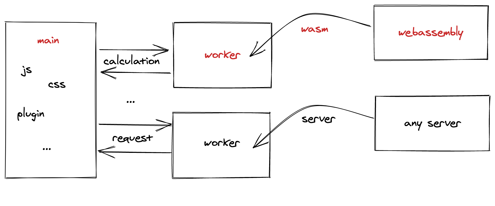

# 学习和使用rust并运用于webassembly

## 工具

### 编译器
需要一个`rust`语言的编译器(`.rs -> .wasm`)。

以下方式任选一个:
1. curl
```bash
curl https://rustwasm.github.io/wasm-pack/installer/init.sh -sSf | sh
```
2. cargo
```bash
cargo install wasm-pack
```

3. npm
```bash
npm install -g wasm-pack
```

4. yarn
```bash
yarn global add wasm-pack
```


实际上`wasm-pack`不仅是一个编译器，他实际上是一系列操作的集合。我们的项目会基于这些操作来开发和完善。

- new 创建一个wasm项目
- build 构建该项目
- test 测试该项目
- pack 打包
- publish 发布

这些命令，看起来就和`npm`类似，你可以把`wasm-pack`视为一个灵活的`cli`工具。

### 模板工具

以已有项目作为模板，创建自己的项目。让你快速启动一个新项目。类似于前端的`create-react-app`等工具。

安装`cargo-generate`。

```bash
cargo install cargo-generate
```

然后你就可以用某个模板来启动项目了

```bash
cargo generate --git https://github.com/rustwasm/wasm-pack-template
```


## 架构

`packages`分为前端架构和wasm架构

- site：基于webpack开发页面展示效果
- wasm-beginner：一些基本算法的引入

如果要基于`wasm`和`worker`来设计一个网站的架构，那么大概是这样的


